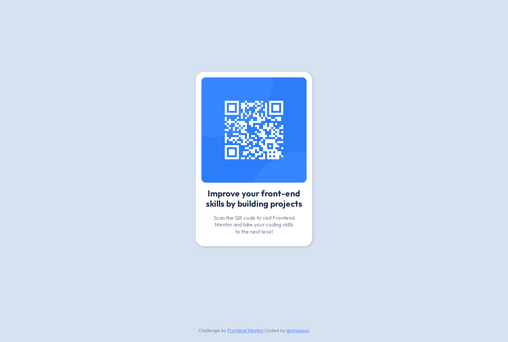

# 👩‍💻 Frontend Mentor - QR code component

[Frontend Mentor challenges](https://www.frontendmentor.io/) help you improve your coding skills by building realistic projects.

This is a solution for [QR Code Component Challenge](https://www.frontendmentor.io/challenges/qr-code-component-iux_sIO_H).

## The challenge
The challenge is to build out this QR code component and get it looking as close to the design as possible.

## Built with

- Semantic HTML5 markup
- CSS custom properties
- Flexbox
- Mobile-first workflow

## Live site solution

[Live site](https://amansgz.github.io/css-qr-code-component/) deployed with GitHub Pages.

## Coding Tips

**How to align elements in the card**

- Adding flex column and space between to the card.

**How to mantain footer at bottom**

- Setting width of 100% to html.
- Adding flex column and min-height of 100% to body.
- Adding margin-top auto to footer.

## Resources

- [10 single layouts in 1 line of CSS](https://youtu.be/qm0IfG1GyZU). 
- [Footer ay bottom](https://youtu.be/yc2olxLgKLk)

## Author

- Frontend Mentor - [@amansgz](https://www.frontendmentor.io/profile/amansgz)